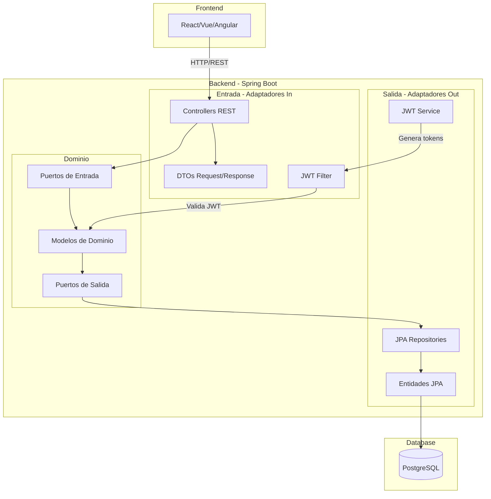
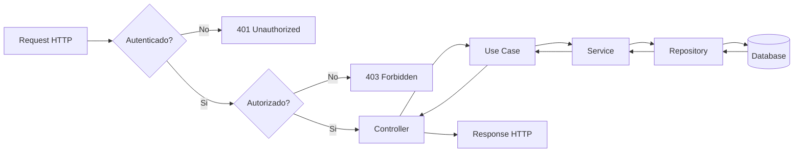
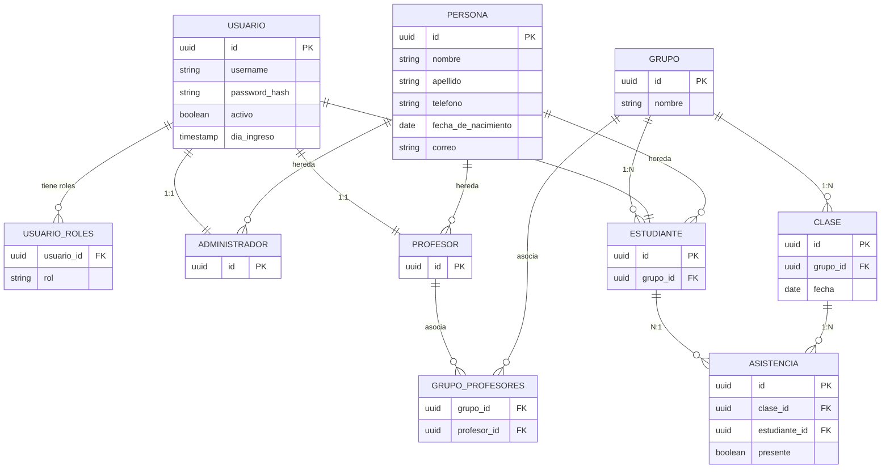
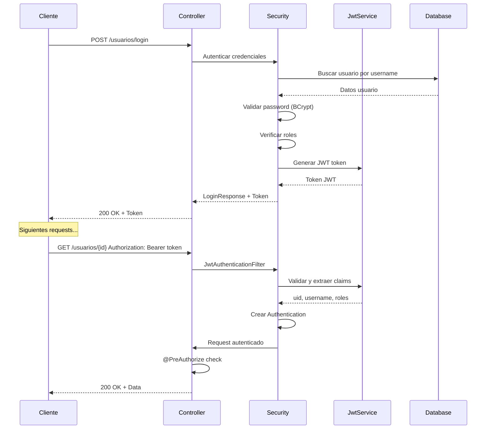

# WebIglesia - ICC San Luis

Sistema de gestion para la Iglesia Cristiana Conciliar (ICC) San Luis. API REST backend para administrar usuarios, grupos, clases y asistencias.

## Tabla de Contenidos

- [Vision General](#vision-general)
- [Arquitectura](#arquitectura)
- [Modelo de Dominio](#modelo-de-dominio)
- [API REST](#api-rest)
- [Seguridad](#seguridad)
- [Configuracion](#configuracion)
- [Deployment](#deployment)
- [Estructura del Proyecto](#estructura-del-proyecto)

---

## Vision General

**WebIglesia** es una aplicacion backend disenada para la Iglesia Cristiana Conciliar San Luis, que permite:

- **Gestionar usuarios**: Administradores, profesores y estudiantes
- **Administrar grupos**: Crear grupos con profesores asignados
- **Registrar asistencias**: Controlar la asistencia de estudiantes a clases
- **Autenticacion segura**: Login con JWT y roles diferenciados

### Stack Tecnologico

| Componente | Tecnologia |
|------------|------------|
| **Lenguaje** | Java 21 |
| **Framework** | Spring Boot 4.0.3 |
| **Build** | Maven |
| **Base de datos** | PostgreSQL (Neon cloud) |
| **Autenticacion** | JWT (HS512) |
| **Seguridad** | Spring Security |
| **Documentacion API** | Springdoc OpenAPI (Swagger) |
| **ORM** | Spring Data JPA + Hibernate |

---

## Arquitectura

### Arquitectura Hexagonal (Puertos y Adaptadores)



### Flujo de una Peticion



---

## Modelo de Dominio

### Diagrama de Entidades (ER)



### Relaciones Principales

| Relacion | Tipo | Descripcion |
|----------|------|-------------|
| `Persona - Administrador/Profesor/Estudiante` | Herencia | Abstracta, comparten ID con Usuario |
| `Usuario - Administrador/Profesor/Estudiante` | 1:1 | Mismo UUID como PK |
| `Usuario - Roles` | N:M | Tabla intermedia `usuario_roles` |
| `Grupo - Profesor` | N:M | Tabla intermedia `grupo_profesores` |
| `Grupo - Estudiante` | 1:N | FK `grupo_id` en estudiante |
| `Grupo - Clase` | 1:N | FK `grupo_id` en clase |
| `Clase - Asistencia` | 1:N | Cascade ALL, orphanRemoval |
| `Asistencia - Estudiante` | N:1 | FK `estudiante_id` |

---

## API REST

### Endpoints de Autenticacion

| Metodo | Ruta | Auth | Descripcion |
|--------|------|------|-------------|
| `POST` | `/usuarios/login` | Publico | Login, retorna JWT |

**Request:**
```json
{
  "nombreusuario": "juan158",
  "contrasena": "password123",
  "rol": "PROFESOR"
}
```

**Response:**
```json
{
  "id": "uuid",
  "username": "juan158",
  "rolesDisponibles": ["PROFESOR", "ADMIN"],
  "rolActivo": "PROFESOR",
  "activo": true,
  "token": "eyJhbGciOiJIUzUxMiJ9..."
}
```

### Endpoints de Usuarios (`/usuarios`)

| Metodo | Ruta | Auth | Descripcion |
|--------|------|------|-------------|
| `GET` | `/usuarios/{id}` | ADMIN o propio | Obtener usuario |
| `PUT` | `/usuarios/editar/{id}` | ADMIN o propio | Editar usuario |
| `PATCH` | `/usuarios/cambiar-estado/{id}` | ADMIN | Activar/desactivar |
| `PATCH` | `/usuarios/{id}/roles` | ADMIN o propio | Asignar roles |

### Endpoints de Administradores (`/administradores`)

| Metodo | Ruta | Auth | Descripcion |
|--------|------|------|-------------|
| `POST` | `/administradores` | ADMIN | Crear administrador |
| `GET` | `/administradores` | ADMIN | Listar todos |
| `GET` | `/administradores/{id}` | ADMIN | Obtener por ID |

### Endpoints de Profesores (`/profesores`)

| Metodo | Ruta | Auth | Descripcion |
|--------|------|------|-------------|
| `GET` | `/profesores` | ADMIN | Listar (?activo=true/false/all) |
| `GET` | `/profesores/{id}` | ADMIN o propio | Obtener por ID |
| `GET` | `/profesores/{id}/grupos` | ADMIN o propio | Grupos del profesor |
| `POST` | `/profesores` | ADMIN | Crear (auto-genera Usuario) |
| `PUT` | `/profesores/{id}` | ADMIN o propio | Editar |
| `POST` | `/profesores/{profesorId}/estudiantes` | ADMIN o PROFESOR | Crear estudiante |
| `POST` | `/profesores/{profesorId}/estudiantes/multiples` | ADMIN o PROFESOR | Crear varios estudiantes |

### Endpoints de Estudiantes (`/estudiantes`)

| Metodo | Ruta | Auth | Descripcion |
|--------|------|------|-------------|
| `POST` | `/estudiantes` | ADMIN o PROFESOR | Crear |
| `PUT` | `/estudiantes/{id}` | ADMIN o PROFESOR | Editar |
| `GET` | `/estudiantes` | ADMIN o PROFESOR | Listar (?query=, ?activo=true/false/all) |
| `GET` | `/estudiantes/{id}` | ADMIN o PROFESOR | Obtener por ID |

### Endpoints de Grupos (`/grupos`)

| Metodo | Ruta | Auth | Descripcion |
|--------|------|------|-------------|
| `POST` | `/grupos` | ADMIN | Crear (1-2 profesores) |
| `PUT` | `/grupos/{id}` | ADMIN o profesor asignado | Editar |
| `GET` | `/grupos` | ADMIN o PROFESOR | Listar (?query=) |
| `GET` | `/grupos/{id}` | ADMIN o profesor asignado | Obtener por ID |
| `DELETE` | `/grupos/{id}` | ADMIN | Eliminar |

### Endpoints de Clases

| Metodo | Ruta | Auth | Descripcion |
|--------|------|------|-------------|
| `POST` | `/grupos/{grupoId}/clases` | ADMIN o profesor del grupo | Registrar asistencia |
| `GET` | `/grupos/{grupoId}/clases` | ADMIN o profesor del grupo | Clases del grupo |
| `GET` | `/clases/{id}` | ADMIN o profesor de la clase | Obtener clase por ID |

### Formato de Errores

```json
{
  "message": "Error description",
  "errors": {
    "campo": "Detalle del error"
  }
}
```

| HTTP Status | Descripcion |
|-------------|-------------|
| 400 | Validacion fallida o regla de negocio |
| 401 | No autenticado |
| 403 | No autorizado |
| 500 | Error interno del servidor |

---

## Seguridad

### Flujo de Autenticacion



### Roles y Permisos

| Rol | Permisos |
|-----|----------|
| `ADMIN` | Acceso total a todos los endpoints |
| `PROFESOR` | Gestionar sus propios datos, crear/editar estudiantes, registrar asistencias de sus grupos |
| `ESTUDIANTE` | **No puede iniciar sesion** (bloqueado por logica de negocio) |

### JWT Configuration

- **Algoritmo**: HS512 (HMAC SHA-512)
- **Claims**: `sub` (username), `uid` (UUID), `roles` (lista de roles)
- **Expiracion**: Configurable via `JWT_EXPIRATION_MS` (default: 2 horas)

### Endpoints Publicos (sin auth)

- `POST /usuarios/login`
- `OPTIONS /**` (CORS preflight)
- `/actuator/**` (Health checks)
- `/swagger-ui.html`, `/v3/api-docs/**` (Documentacion API)

---

## Configuracion

### Variables de Entorno

| Variable | Proposito | Ejemplo |
|----------|-----------|---------|
| `DATABASE_URL` | URL JDBC de PostgreSQL | `jdbc:postgresql://host:5432/neondb?sslmode=require` |
| `frontend_url` | Origen CORS permitido | `http://localhost:5173` |
| `ADMIN_USERNAME` | Username del admin inicial | `admin` |
| `ADMIN_PASSWORD` | Password del admin inicial | `admin123` |
| `ADMIN_NOMBRE` | Nombre del admin | `Administrador` |
| `ADMIN_APELLIDO` | Apellido del admin | `Sistema` |
| `ADMIN_CORREO` | Email del admin | `admin@iglesia.com` |
| `JWT_SECRET` | Clave HMAC para JWT (Base64) | `clave-secreta-aqui` |
| `JWT_EXPIRATION_MS` | Expiracion del token | `7200000` (2 horas) |

### Configuracion de Desarrollo

```bash
# Clonar el repositorio
git clone https://github.com/tu-usuario/WebIglesia.git
cd WebIglesia

# Crear archivo .env
cp .env.example .env
# Editar .env con tus variables

# Ejecutar
./mvnw spring-boot:run
```

### Configuracion de Base de Datos

El proyecto usa **Neon** (PostgreSQL en la nube) con las siguientes tablas generadas por Hibernate:

| Tabla | Origen | Notas |
|-------|--------|-------|
| `usuario` | `UsuarioEntity` | PK: UUID |
| `usuario_roles` | `@ElementCollection` | Tabla intermedia para roles |
| `administrador` | `AdministradorEntity` | Hereda de Persona |
| `profesor` | `ProfesorEntity` | Hereda de Persona |
| `estudiante` | `EstudianteEntity` | Hereda de Persona, tiene `grupo_id` |
| `grupo` | `GrupoEntity` | |
| `grupo_profesores` | `@ManyToMany` | Tabla intermedia |
| `clase` | `ClaseEntity` | |
| `asistencia` | `AsistenciaEntity` | |

---

## Deployment

### Docker

```dockerfile
# Multi-stage build
FROM eclipse-temurin:21-jdk-jammy AS build
WORKDIR /app
COPY . .
RUN ./mvnw clean package -DskipTests

FROM eclipse-temurin:21-jre-jammy
WORKDIR /app
COPY --from=build /app/target/*.jar app.jar
EXPOSE ${PORT:-8080}
ENTRYPOINT ["sh", "-c", "java $JAVA_OPTS -Dserver.port=${PORT:-8080} -jar app.jar"]
```

### Render

1. Conectar repositorio de GitHub
2. Configurar variables de entorno en Render Dashboard
3. Deploy automatico al hacer push a `main`

### GitHub Actions - Keep Alive Weekend

El proyecto incluye un workflow para mantener la app activa solo los fines de semana:

```yaml
# .github/workflows/keep-alive.yml
schedule:
  - cron: '*/13 8-23 * * 5'  # Viernes 8AM-11PM
  - cron: '*/13 * * * 6'     # Sabado todo el dia
  - cron: '*/13 * * * 0'     # Domingo todo el dia
```

---

## Estructura del Proyecto

```
WebIglesia/
├── .github/
│   └── workflows/
│       └── keep-alive.yml
├── .agents/
│   └── skills/
│       ├── update-agents-md/
│       ├── java-coding-standards/
│       ├── java-docs/
│       ├── java-springboot/
│       └── java-documentation-specialist/
├── src/main/java/icc/sanluis/webiglesia/
│   ├── IccSanLuisApplication.java
│   ├── domain/
│   │   └── usuario/
│   │       ├── model/
│   │       │   ├── Rol.java
│   │       │   ├── Persona.java
│   │       │   ├── Usuario.java
│   │       │   ├── Administrador.java
│   │       │   ├── Profesor.java
│   │       │   ├── Estudiante.java
│   │       │   ├── Grupo.java
│   │       │   ├── Clase.java
│   │       │   └── Asistencia.java
│   │       ├── exceptions/
│   │       │   └── EstudianteNoPuedeIniciarSesionException.java
│   │       └── ports/
│   │           ├── in/  (12 Command records)
│   │           └── out/ (7 Port interfaces)
│   ├── application/
│   │   └── usuario/
│   │       ├── usecases/ (21 Use Case interfaces)
│   │       └── services/ (19 Service implementations)
│   └── infrastructure/
│       ├── config/
│       │   ├── SecurityConfig.java
│       │   ├── CorsConfig.java
│       │   ├── UsuarioUseCaseConfig.java
│       │   └── AdminSeeder.java
│       └── adapters/
│           ├── in/
│           │   ├── controllers/
│           │   │   ├── usuario/
│           │   │   │   ├── UsuarioController.java
│           │   │   │   ├── AdministradorController.java
│           │   │   │   ├── ProfesorController.java
│           │   │   │   ├── EstudianteController.java
│           │   │   │   ├── GrupoController.java
│           │   │   │   ├── ClaseController.java
│           │   │   │   └── dto/
│           │   │   └── GlobalExceptionHandler.java
│           │   └── security/
│           │       ├── JwtAuthenticationFilter.java
│           │       ├── UsuarioPrincipal.java
│           │       └── AuthorizationService.java
│           └── out/
│               ├── persistence/
│               │   ├── entities/
│               │   ├── repositories/
│               │   └── usuario/
│               └── security/
│                   ├── JwtService.java
│                   └── BCryptPasswordHasherAdapter.java
├── Dockerfile
├── pom.xml
└── .env
```

---

## Licencia

Proyecto privado - Iglesia Cristiana Cuadrangular San Luis
